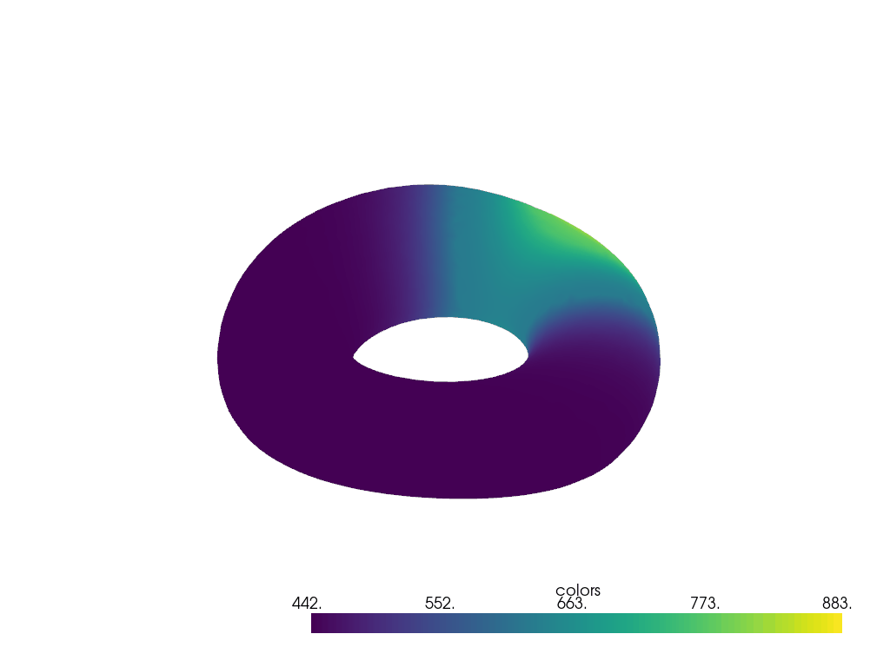
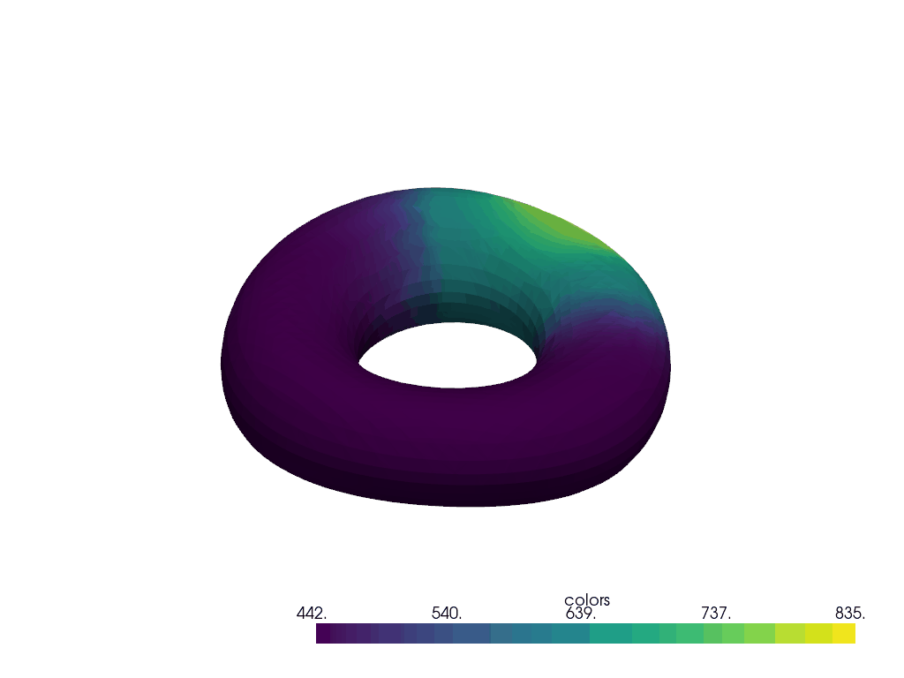

"coloured_torus" folder is used to generate data for synthetic data experiment.

"dealing_with_data" folder generates data for cortical thickness data experiment.

Difference between synthetic experiment code and cortical thickness experiment code,
former code deals with 3 channels of input while, latter code has been modified to 
process only a single channel of input (cortical thickness).

# Synthetic Data Generation Results

<table>
  <tr>
    <td align="left">
      
    </td>
    <td align="right">
      
    </td>
  </tr>
</table>

